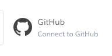

# DEPRECATED!!!!

# Front End Design Elective

## Deployment git/heroku

### What is this?

In order to solve the exam assignment, you have to hook up to a server we've built.

You only need one server per group, so choose one to do it.

1. For this repository
2. Go to <a href="https://heroku.com">Heroku.com</a> and sign up for a free account.
3. once you're logged in, follow these steps to connect your repository to Heroku

4. Click "Create new app" 
   
5. Choose a unique name for it and choose Europe as the region 
   
6. Click "Connect to GitHub" and follow the instructions 
   
7. Link the repository (foofest) to your Heroku account 
   
8. Click "Connect" 
   
9. Activate "Automatic Deploy" and then "Deploy Branch"
10. Once it has finished, you should be able to click "Open app". That will open a rather boring page, try appending `/bands` to the URL to verify it's working

### Endpoints

All endpoints are [documented here](https://jonasholbech.github.io/Foofest-Exam-API-Docs/)
